All tutorials on this website can be completed using [Google Colab](https://colab.research.google.com/), but for those who want to install Python on their own (local) machine, here are a couple different ways of installing it.

A typical installation for Python involves two things:

1. Downloading Python
2. Downloading ~something to write Python documents (scripts) in~

The most common way of installing Python is through python.org, though there are other distributions such as Anaconda. Either of these would be sufficient, but I've grown fond of what I'm going to call "the easy way", which uses Positron and enforces more of a project-based system for Python environments. The two different installation guides below walk you through installing Python step-by-step. 

::: {.callout-note title="A note for the Linux fans"}

Linux users, I presume you know what you're doing 🤠 but you should also be able to follow the instructions here, if needed.

:::

:::{.panel-tabset}

## The easy way

### Work with Positron

[Positron](https://positron.posit.co/) is a relatively new IDE (aka "integrated development environment") that essentially combines some of the best of RStudio and VSCode (two alternatives) into one interface. In general, IDEs typically have some extra features that help with writing code -- that's sorta what makes them special. Positron can function just as a text editor, but it also has that additional functionality that can be nice. 

Positron intends to provide features that make it ideal for working with data and it has built-in support for generating virtual environments for your projects. A virtual environment is like a sandbox - within the boundaries of the sandbox, we can install anything we need to use to write Python code for our project, but it doesn't affect the rest of our installation (unlike any *actual* sandbox, the sand doesn't escape). Critically: it just makes it easier to navigate dependencies for different projects, but if that's gibberish to you, don't worry about that for now.

### Install Positron

First, download the Positron installer that is applicable for your device. When you click on the `Download` button, you will be asked to `Agree` to their Terms and Conditions:
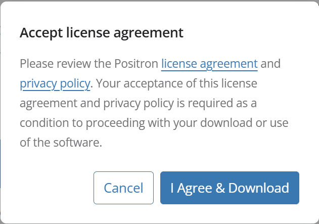

Once you agree, the download will begin.

The Positron installer will appear in your `Downloads` folder. In `Finder` {width=24} for Mac or `File Explorer` {width=24} for Windows, navigate to your `Downloads` folder in the left sidebar. When you click on the installer, the steps for installation will vary slightly depending on your operating system

#### Mac
When you click on the installer, it will open a window where you will drag and drop Positron into your `Applications` folder:
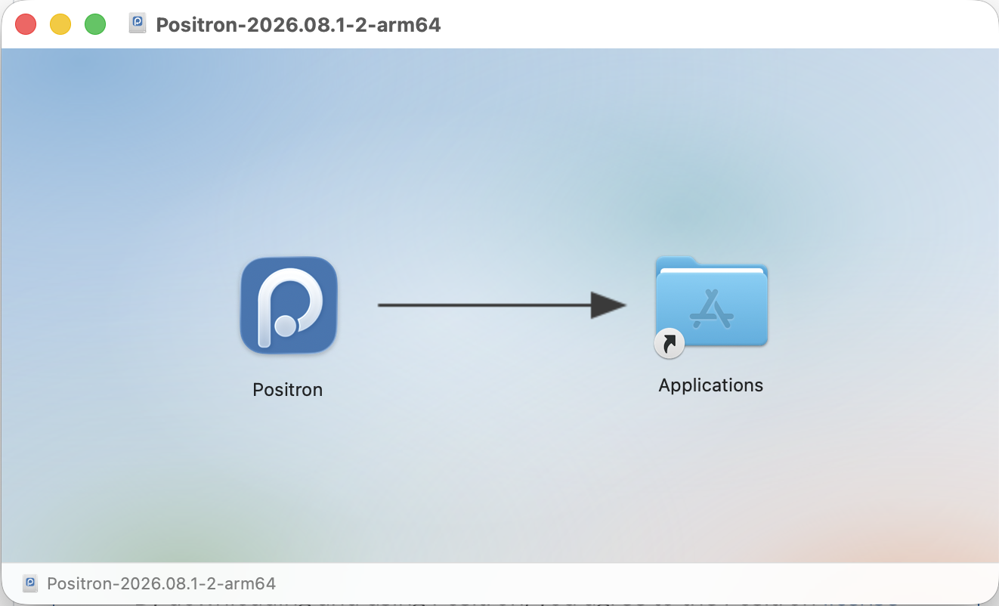

And you're done!

#### Windows

First, the installer will (perhaps, again) ask you to agree to the License Agreement:
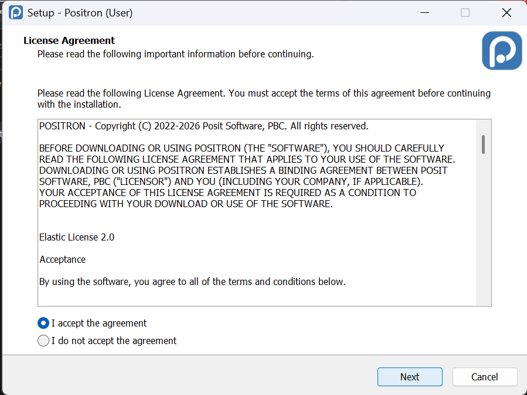

Then, you'll be asked to select the destination folder where it should be installed. Unless you know where it should be installed otherwise, accept the default location by clicking `Next`:
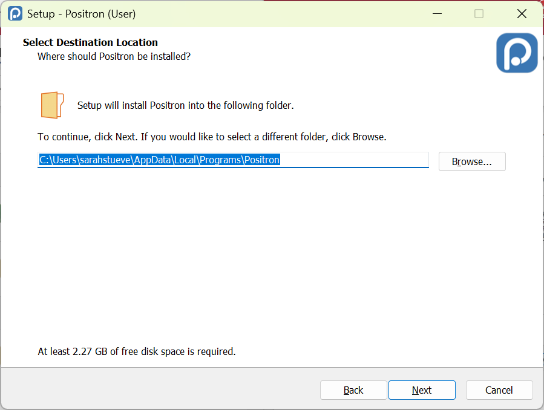

Then, you'll be asked to select the Start Menu folder, where you should very likely go with the default. Click `Next`:
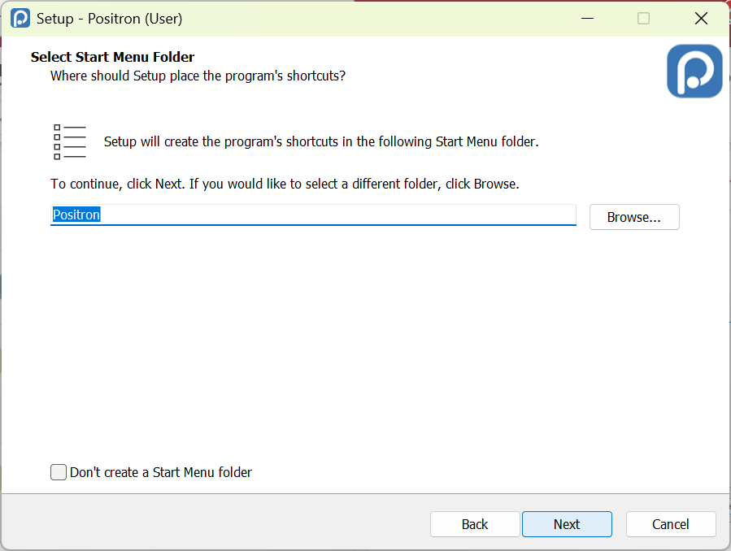

You'll be asked to "Select Additional Tasks". I would recommend sticking with the defaults again here. Click `Next`:
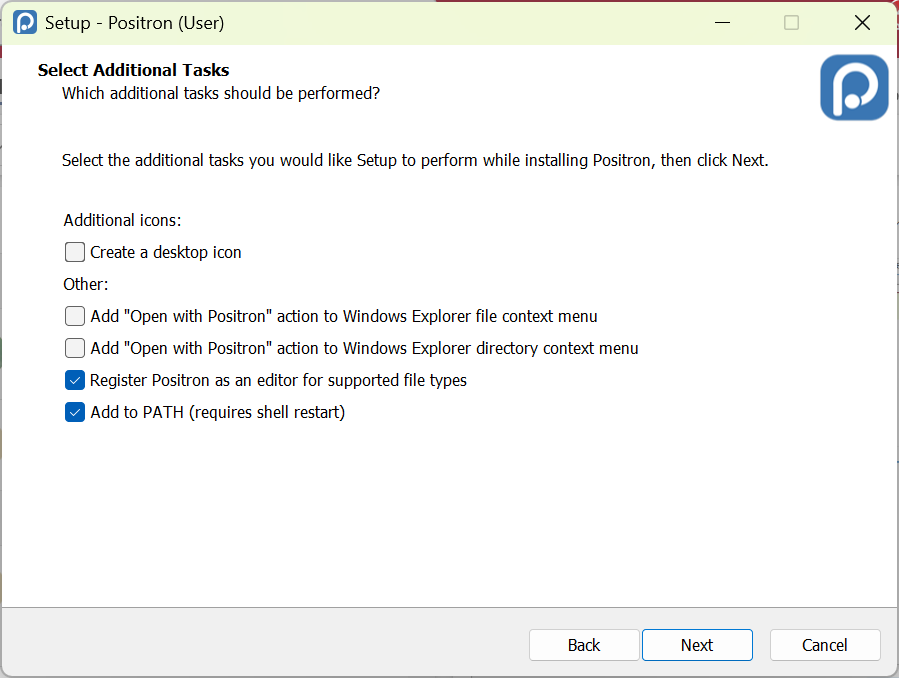

Finally, confirm you want to start the installation by clicking `Install`:
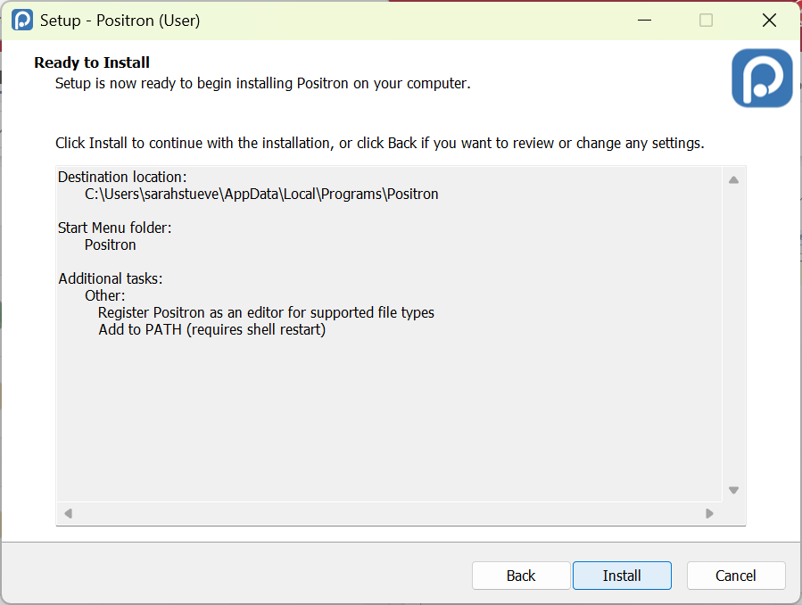

It will produce a progress bar that shows it installing. At the end of the installation process, you'll click `Finish` to close the installer. This will Launch Positron unless you explicitly ask it not to do so.

And you're done!

### Create a python Session for a given project

Create a "Project" (or, a folder for your work)

Start a session/create an environment

`uv init`

`uv add pandas plotnine matplotlib seaborn`

## The traditional way

### Install Python from [python.org](python.org)

While the instructions below are for the Mac installer, the Windows installation will be similar. Basically: allow the installer to choose the defaults and "Continue" and "Agree".

First, select the installer that's appropriate for your device. Hover over the `Downloads` tab and then select the appropriate installer (if you have a Windows computer, choose the Windows installer, etc.):
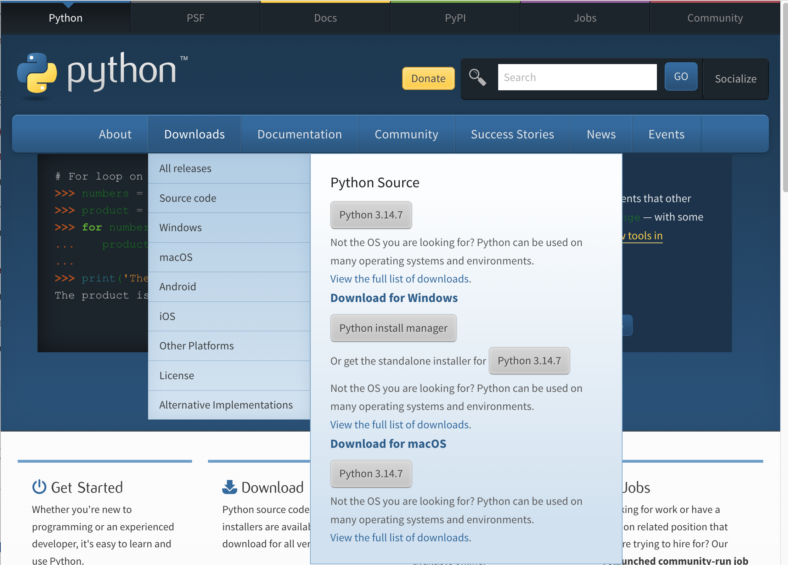

When you click on the appropriate installation, it will trigger the download of the installer. In `Finder` {width=24} for Mac or `File Explorer` {width=24} for Windows, navigate to your `Downloads` folder in the left sidebar. Click on the installer to start the installation process:

**Mac**
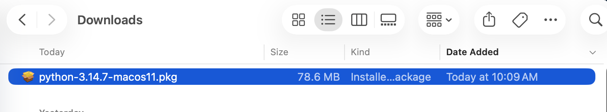

**Windows**

Once you click on the Installer, a window will pop up to guide you through the installation process. For the most part, just click `Continue`:
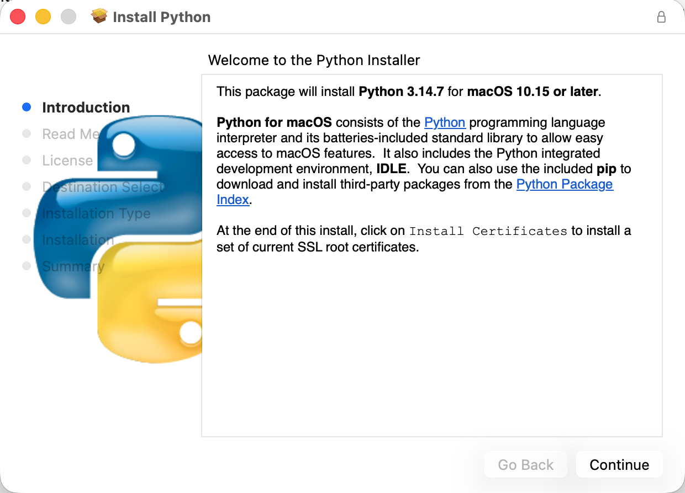

Eventually, you will be asked to `Agree` to their License:
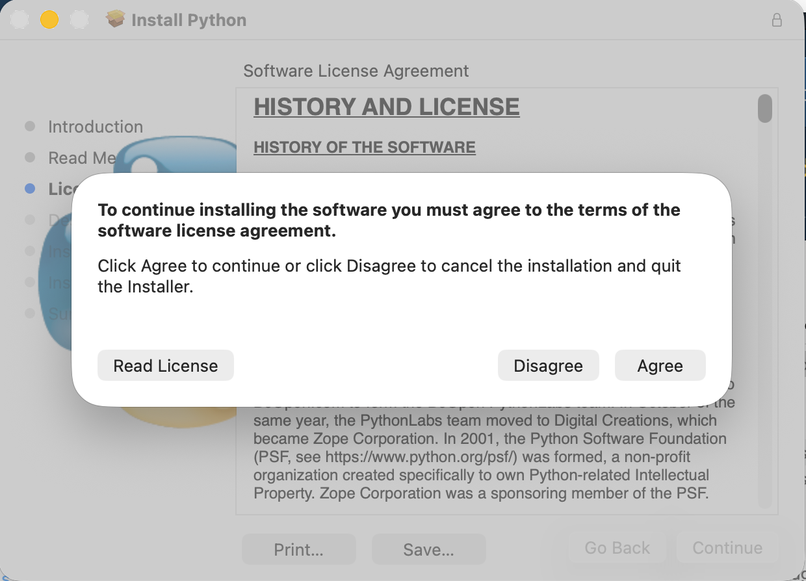

And then you will be prompted to start the installation:
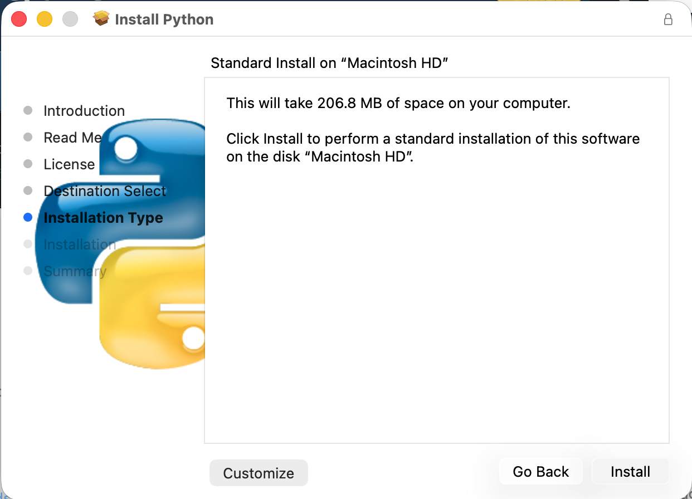

There will be a couple other windows after that, but the installation will practically be complete. You have Python now! 

### Download VSCode 

Python is the language (like Spanish or Chinese). When we write in a language, we typically either have paper or we use an application like Word or something similar. We need the same kind of tool for writing Python! These can be called "text editors" or IDEs. An IDE is an "integrated development environment" and typically has some extra features that help with writing code. VSCode can function just as a text editor, but it also has additional functionality that can be nice!

First, we'll navigate to https://code.visualstudio.com/ to download the application. When you get there, it should recommend the version you want. At the time of writing, it highlights AI integration -- know that you do not have to use it (AI's just a buzzword). Click the button in the center of the screen that says `Download ...`:
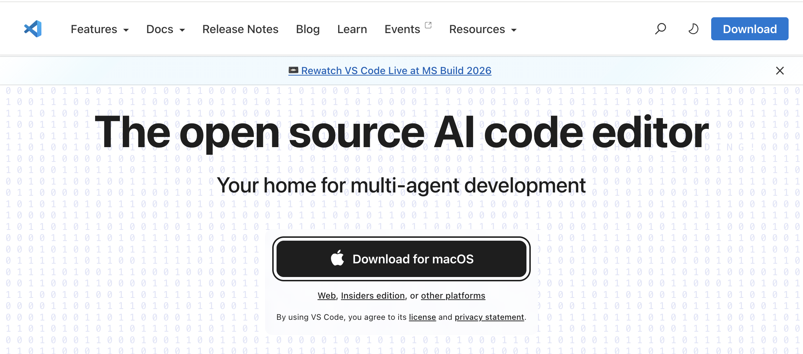

The VSCode installer, like the Python installer, will go into your `Downloads` folder:
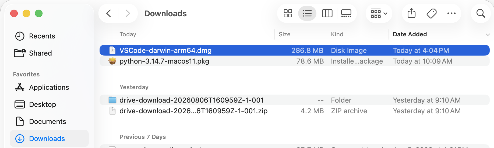

Unlike Python, there isn't a long process to install it. You will simply click and drag VSCode (following the arrow shown) into your `Applications` folder:
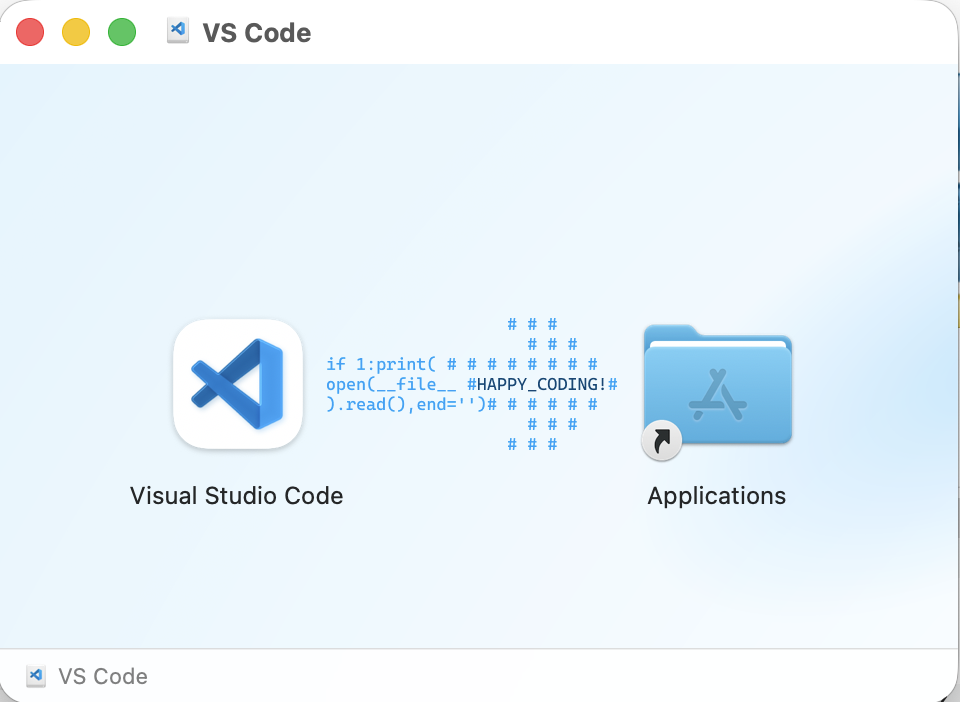

And, you're ready!

<!-- ### Last but not least: installing packages

This is where, long-term, Python can be difficult, *but* you shouldn't have problems with most (if not all) of the packages used in these tutorials. 

Let's start with a metaphor. Imagine you open your computer and get started with what you want to do during the day. Maybe you open your email app. Maybe you open the Zoom app. Maybe you open your internet browser. Each of those applications has a specific purpose, right? So, you open each of them when you need to complete a task that requires them.

We have something similar in Python and they're called **packages**! Before we complete a task that requires specific features in Python, we often need to install a package (like our email in the earlier metaphor) in order to use it.

The classic method for installing packages in Python involves using `pip`. Each of the tutorials will outline the packages that need to be installed, but I'll provide a some that you will need and that I would recommend here.

To install packages, we're actually going to open up a separate app that your computer has by default. On Mac, this will be your `Terminal`, and on Windows this will be `PowerShell`.  -->

:::
