All tutorials on this website can be completed using [Google Colab](https://colab.research.google.com/), but for those who want to install Python on their own (local) machine, here are a couple different ways of installing it.

A typical installation for Python involves two things:

1. Downloading Python
2. Downloading ~something to write Python documents (scripts) in~

The most common way of installing Python is through python.org, though there are other distributions such as Anaconda. Either of these would be sufficient, but I've grown fond of what I'm going to call "the easy way", which uses Positron and enforces more of a project-based system for Python environments. The two different installation guides below walk you through installing Python step-by-step. 

::: {.callout-note title="A note for the Linux fans"}

Linux users, I presume you know what you're doing 🤠 but you should also be able to follow the instructions here, if needed.

:::

:::{.panel-tabset}

## The easy way

### Work with Positron

[Positron](https://positron.posit.co/) is a relatively new IDE (aka "integrated development environment") that essentially combines some of the best of RStudio and VSCode (two alternatives) into one interface. In general, IDEs typically have some extra features that help with writing code -- that's sorta what makes them special. Positron can function just as a text editor, but it also has that additional functionality that can be nice. 

Positron intends to provide features that make it ideal for working with data and it has built-in support for generating virtual environments for your projects. A virtual environment is like a sandbox - within the boundaries of the sandbox, we can install anything we need to use to write Python code for our project, but it doesn't affect the rest of our installation (unlike any *actual* sandbox, the sand doesn't escape). Critically: it just makes it easier to navigate dependencies for different projects, but if that's gibberish to you, don't worry about that for now.

### Install Positron

First, download the Positron installer that is applicable for your device. When you click on the `Download` button, you will be asked to `Agree` to their Terms and Conditions:


Once you agree, the download will begin.

The Positron installer will appear in your `Downloads` folder. In `Finder` {width=24} for Mac or `File Explorer` {width=24} for Windows, navigate to your `Downloads` folder in the left sidebar. When you click on the installer, the steps for installation will vary slightly depending on your operating system

#### Mac
When you click on the installer, it will open a window where you will drag and drop Positron into your `Applications` folder:


And you're done!

#### Windows

First, the installer will (perhaps, again) ask you to agree to the License Agreement. Accept and click `Next`:


Then, you'll be asked to 

1. select the destination folder where it should be installed, 
2. select the start menu folder, 
3. and delect additional tasks. 

For each of these installer pages, you should accept the defaults Positron suggests by clicking `Next`.

Finally, confirm you want to start the installation by clicking `Install`:


It will produce a progress bar that shows it installing. At the end of the installation process, you'll click `Finish` to close the installer.

And you're done!

### Create a python Session for a given project

Create a "Project" (or, a folder for your work) by selecting the `New Folder...` option on the Welcome page or by selecting `New Folder from Template...` from the `+ New` button in the top left corner of the IDE. You'll select `Python Project` from the template and then click `Next`:
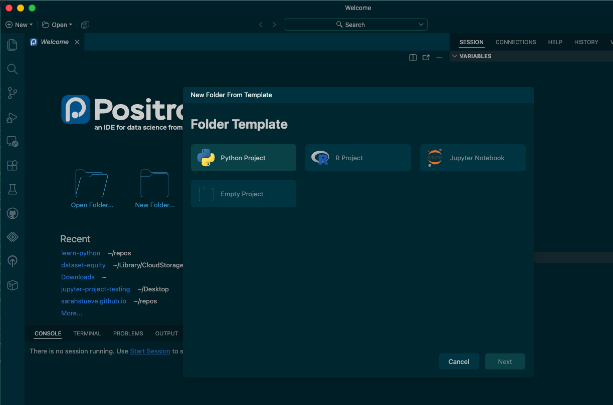

You'll be asked to select a location for the project. You can click `Browse...` to choose a different location than the one provided (i.e., if you want the folder in your `Documents` folder). You will also provide the name of the folder you want to create!
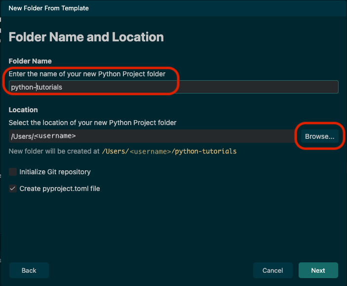

Then, you'll be asked if you want to create a Python environment with `uv`. You should leave the defaults as they are and click `Create`:
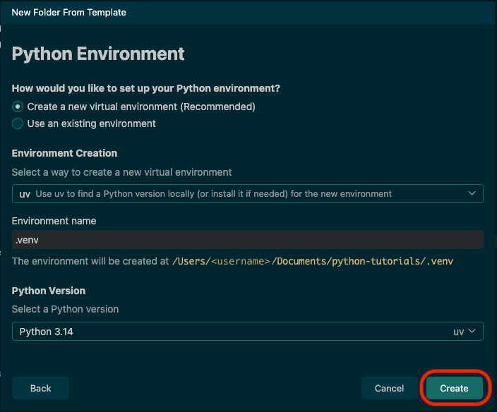

Once you create the environment, this is the first page you will see when you open the new folder. To make sure our Python environment is setup correctly, we need to install the required packages for the tutorial. To do this, first click on the `TERMINAL` tab in the middle-bottom section of Positron:
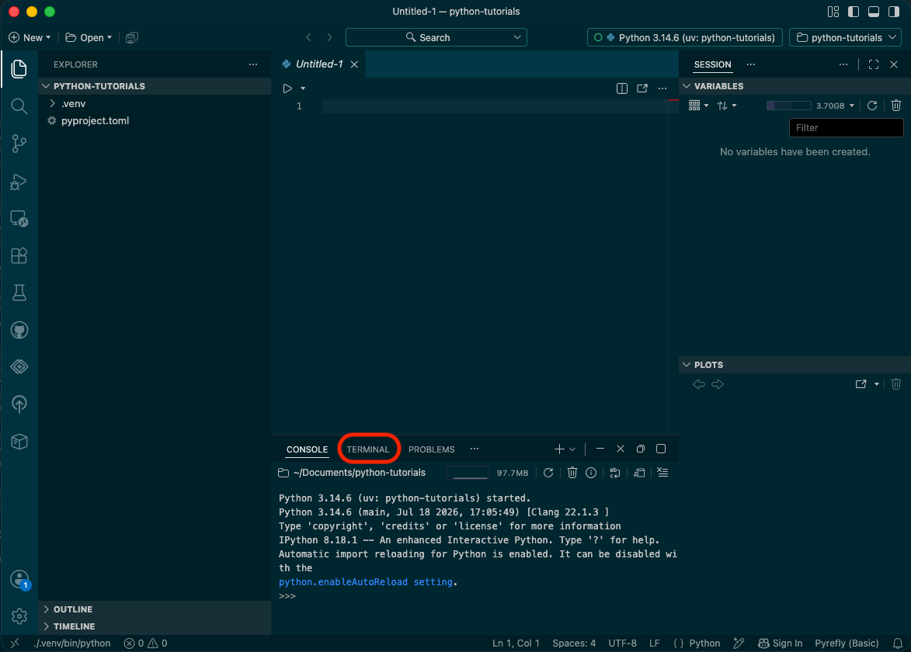

Once the Terminal is open, we'll run a command to install packages using `uv add`. The syntax looks like this: `uv add package1 package2 package3 ...`. The first tutorial on this website relies on the following packages, so let's start with installing those! Run the below command in Terminal like so:

```{bash}
uv add pandas plotnine matplotlib seaborn jupyter
```

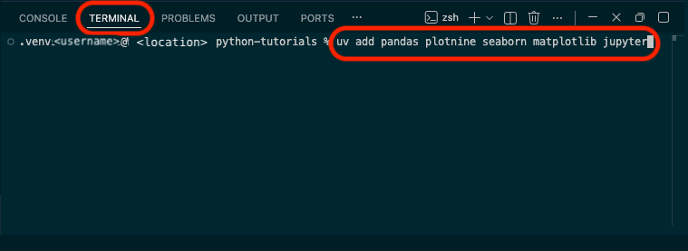

Once the packages are installed, you're ready to create your first Jupyter Notebook (it's an interactive document that allows us to both write code and take notes!). In the left side bar, click on the `New File...` icon 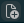 and then type in the name of the file you want to create. Whatever it is, it has to include the file extension (think .docx, or .xlsx) `.ipynb` for "iPython Notebook":
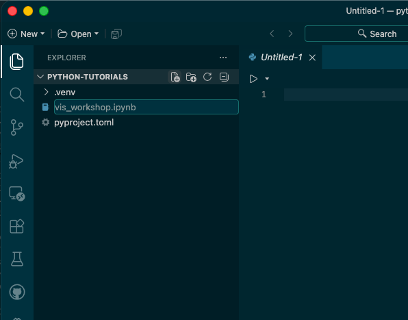

To start writing code, the last step you'll take is clicking on the `+Code` button at the top right of the new document to make a code block.
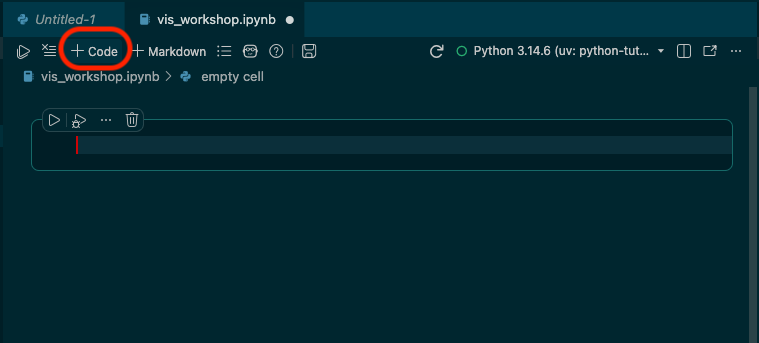

You're ready!

## The traditional way

### Install Python from [python.org](python.org)

While the instructions below are for the Mac installer, the Windows installation will be similar. Basically: allow the installer to choose the defaults and "Continue" and "Agree".

First, select the installer that's appropriate for your device. Hover over the `Downloads` tab and then select the appropriate installer (if you have a Windows computer, choose the Windows installer, etc.):


When you click on the appropriate installation, it will trigger the download of the installer. In `Finder` {width=24} for Mac or `File Explorer` {width=24} for Windows, navigate to your `Downloads` folder in the left sidebar. Click on the installer to start the installation process:

#### Mac


Once you click on the Installer, a window will pop up to guide you through the installation process. For the most part, just click `Continue`:


Eventually, you will be asked to `Agree` to their License:


And then you will be prompted to start the installation:


There will be a couple other windows after that, but the installation will practically be complete. You have Python now! 

#### Windows

Once you've downloaded your distribution of Python, it should be in your `Downloads` folder. Click on the installer to launch it:
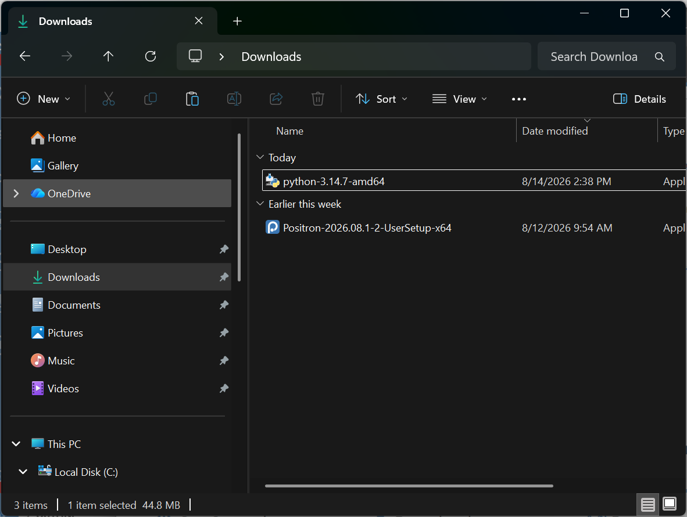

From there, you'll see the page to launch the installer. _NOTE: Make sure you check the option to **add Python to the PATH**_ - this is _extremely_ important. If you don't do it, it's fixable, but it's annoying. From there, click the button for standard installation, `Install Now`:
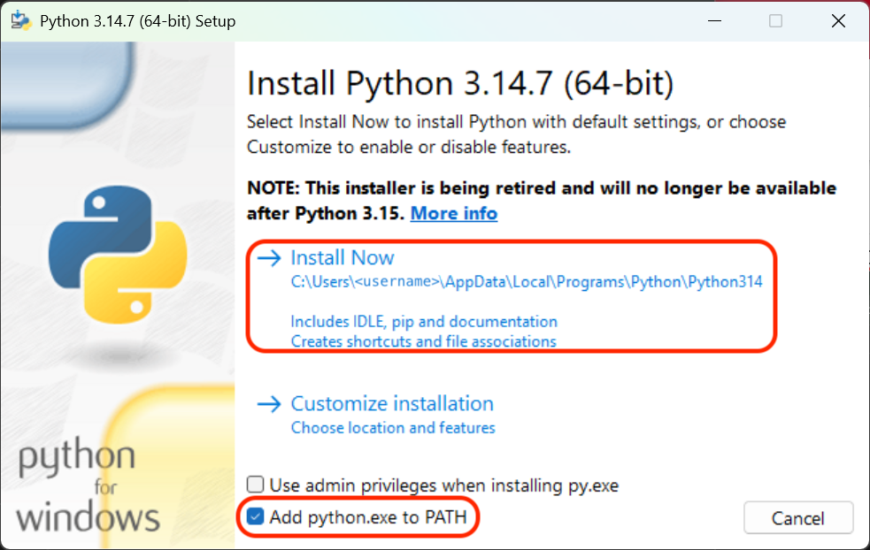

From there, the installation will commence. When it completes, you have Python set up and ready!

### Download VSCode 

Python is the language (like Spanish or Chinese). When we write in a language, we typically either have paper or we use an application like Word or something similar. We need the same kind of tool for writing Python! These can be called "text editors" or IDEs. An IDE is an "integrated development environment" and typically has some extra features that help with writing code. VSCode can function just as a text editor, but it also has additional functionality that can be nice!

First, we'll navigate to https://code.visualstudio.com/ to download the application. When you get there, it should recommend the version you want. At the time of writing, it highlights AI integration -- know that you do not have to use it (AI's just a buzzword). Click the button in the center of the screen that says `Download ...`:


The VSCode installer, like the Python installer, will go into your `Downloads` folder:


#### Mac

Unlike Python, there isn't a long process to install it. You will simply click and drag VSCode (following the arrow shown) into your `Applications` folder:


And, you're ready!

#### Windows

First, you'll be asked to agree to the license. Agree and click `Next`:
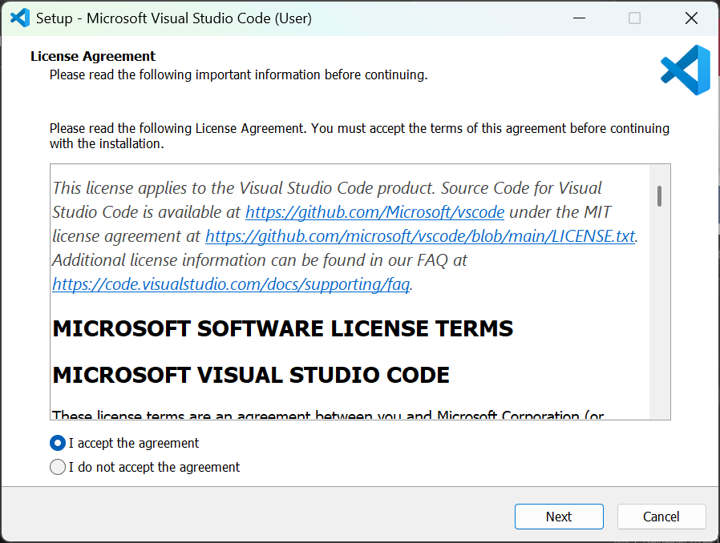

From there, you'll be asked to choose the location of VSCode. Accept the default path by clicking `Next`:
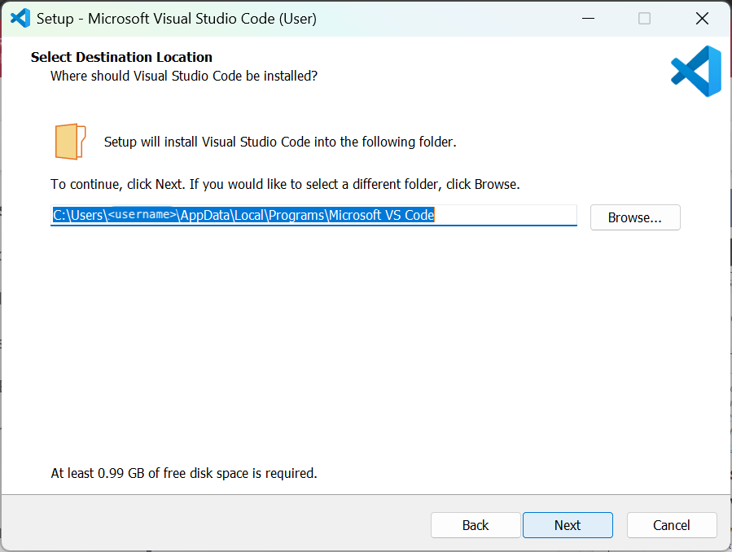

Click `Next` for the next two pages:

1. Selecting a start menu folder
2. Selecting additional tasks

And then finally click `Install` on the `Ready to Install` page:
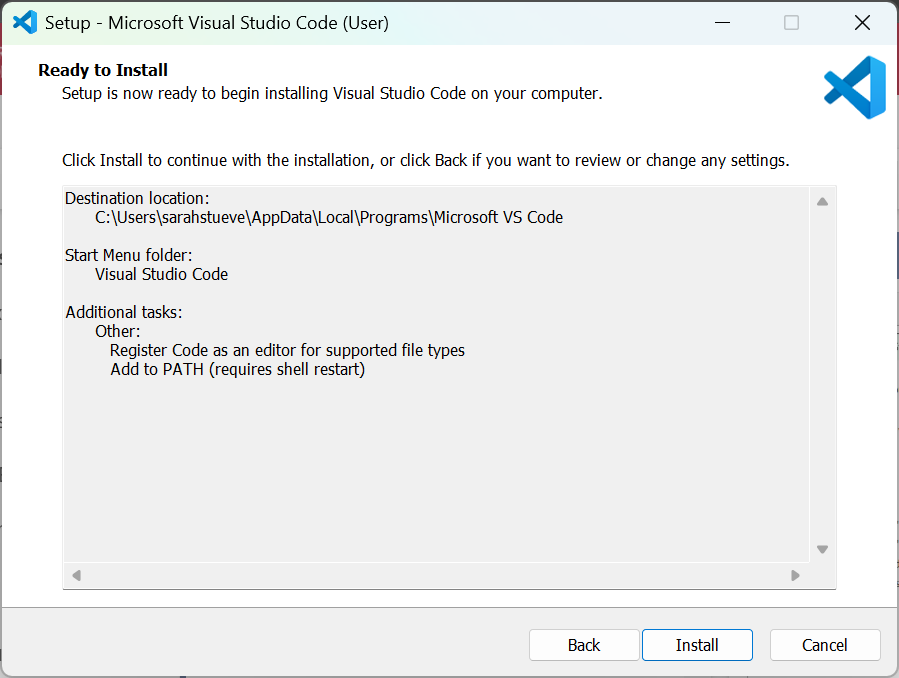

Once the app finishes installing, you're ready to go!

### Create a new folder for tutorials

Open up the VSCode application we just installed. When you do, you'll see the _Welcome_ page. Click on the option to `Open...` a folder or file:


When the file management system opens up, choose the folder you would like to Open. If you have created a folder already, open that one! Otherwise, create a `New Folder` in the place you want it to be saved:

#### Mac
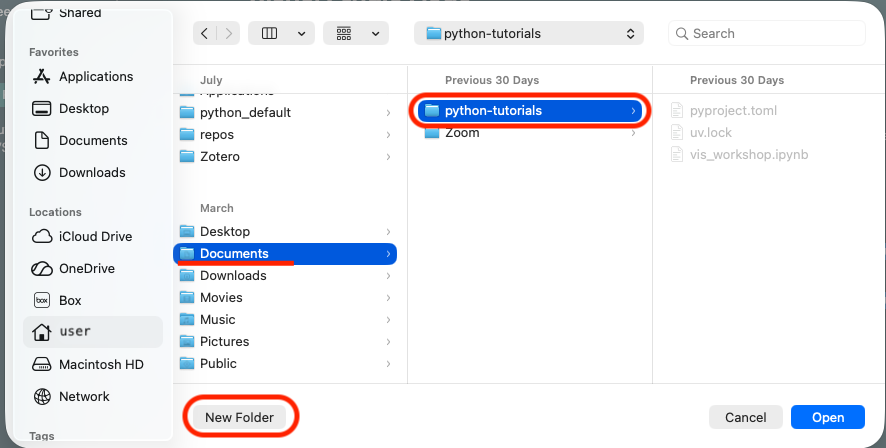

#### Windows
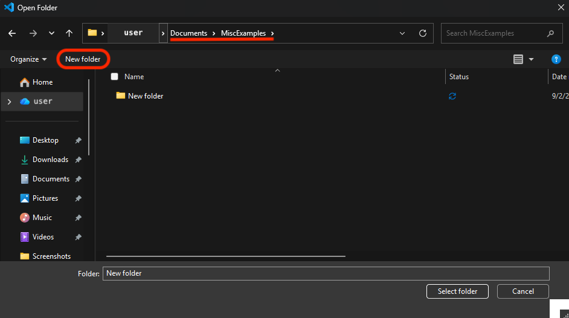


### Last but not least: installing packages

This is where, long-term, Python can be difficult, *but* you shouldn't have problems with most (if not all) of the packages used in these tutorials. 

Let's start with a metaphor. Imagine you open your computer and get started with what you want to do during the day. Maybe you open your email app. Maybe you open the Zoom app. Maybe you open your internet browser. Each of those applications has a specific purpose, right? So, you open each of them when you need to complete a task that requires them.

We have something similar in Python and they're called **packages**! Before we complete a task that requires specific features in Python, we often need to install a package (like our email app in the earlier metaphor) in order to use it. 

This tutorial provides two options for Python "package managers":

#### Using `uv` (recommended)

`uv` is a newer Python package manager (it makes sure all our "apps" work together) and it's extremely fast. It's also reliable for managing conflicting dependencies (apps/packages that don't work together). I will recommend using `uv` instead of `pip` to make sure you're starting off on the right foot when it comes to tidy Python development.

However, to install `uv`, we will (somewhat ironically) use `pip`. Open a new `Terminal` window using the `Terminal` tab in the top left corner of your screen or VSCode window. Once you have the `Terminal` open, run the following command:

```{bash}
pip install uv
```

Once you have `uv` installed, we're going to initialize the `uv` project. `uv` treats folders as "Projects", similar to some other programming languages. So, first we need to initialize the project:

```{bash}
uv init
```

Then, we tell `uv` to make what we call a "virtual environment". You can think of it kinda like a sandbox, where the sand is all the "apps"/packages that we want to play nicely in our environment. It does _not_ affect the rest of your Python environment, so if something goes wrong (which does happen in Python), it's easy to recreate. It also makes it easier to share what exact packages you used to run your Python code. You should create one of these for each of your projects. To create the virtual environment, type:

```{bash}
uv venv
```

You should see a message telling you the virtual environment was created and also see a new folder in your left sidebar called `.venv`. Python (and VSCode) recognize this as an environment folder.

Once the environment is created, we tell `uv` which packages we want to put in it. So, here's an example command. It always starts with `uv add` followed by all of the packages you want to install, separated by spaces. Don't worry - if you forget to add a package the first time you create the environment or need to add another one, you just run `uv add` again with the package you want to install.

```{bash}
uv add pandas plotnine seaborn matplotlib jupyter
```

Here is what these commands look like in the VSCode `Terminal`:

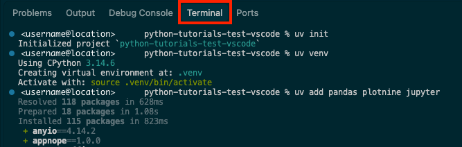

Finally, we run the command `uv sync` to make sure our environment and the project file created by uv (`pyproject.toml`) are synced together.


#### Using `pip` (the original)

The classic method for installing packages in Python involves using `pip`. Each of the tutorials will outline the packages that need to be installed, but I'll provide a some that you will need and that I would recommend here.

To install packages using `pip`, we're actually going to open up a separate app that your computer has by default. On Mac, this will be your `Terminal`, and on Windows this will be `PowerShell`. You can search for your respective app using Spotlight Search on Mac (press <CMD><SPACE> on your keyboard) or in the Windows menu.

Once you have your `Terminal` or `PowerShell` open, we'll run this command:

```{bash}
pip3 install pandas plotnine matplotlib seaborn jupyter
```

##### Mac

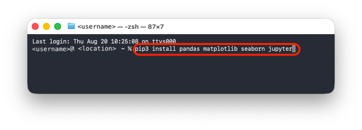

##### Windows

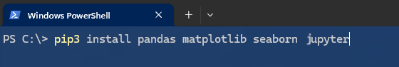

Once the packages are installed, you're ready to create your first Jupyter Notebook (it's an interactive document that allows us to both write code and take notes!). 

### Create a new Jupyter Notebook: it's time to write some code!

In the left side bar, click on the `New File...` icon  and then type in the name of the file you want to create. Whatever it is, it has to include the file extension (think .docx, or .xlsx) `.ipynb` for "iPython Notebook":


To start writing code, the last step you'll take is clicking on the `+Code` button at the top right of the new document to make a code block.


You're ready to go!

:::
